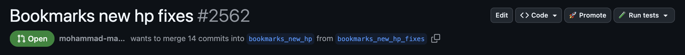

# 🚀 lazy `/promoter`

*Because typing `/promote` is way too much work*

This Chrome extension adds:
- "🚀 Promote" button and "🧪 Run tests" dropdown on PRs in `anghami/web-streaming-monorepo`
- "👍 Approve" button on PRs in `anghami/argocd`
- **PR Reviewability Scoring** on the PR list page in `anghami/web-streaming-monorepo`



## What it does

### Promote Button
- Posts `/promote` comment via GitHub API
- Makes the rocket emoji launch off when you click it (because why not waste company time to please yourself?)

### Run Tests Dropdown
- Adds a dropdown button next to the Promote button
- Provides quick access to run e2e tests:
  - **Run TV e2e tests** - Posts `/test-e2e tv` comment
  - **Run Web e2e tests** - Posts `/test-e2e web` comment
- Shows loading and success states, just like the Promote button

### Approve Button (argocd only)
- Appears only on PR pages in `anghami/argocd`
- Approves the PR in a single click using GitHub's reviews API (`event: "APPROVE"`)
- Shows loader and success/error states
- Requirements and caveats:
  - You must have permission to review in the repo
  - You cannot approve your own PR
  - Draft PRs cannot be approved

### PR Reviewability Scoring
Automatically scores PRs on the pull request list page to help you prioritize which PRs to review first.

**How it works:**
- PRs are color-coded: **green** (score ≥ 4) or **red** (score < 4)
- Higher saturation = more extreme score (very good or very bad)
- Draft PRs are ignored entirely
- PRs you've already reviewed are ignored (unless your review was dismissed or new commits were pushed)

**Scoring criteria:**

| Metric | Condition | Deduction |
|--------|-----------|-----------|
| Files changed | 20-39 files | -1 |
| Files changed | 40-59 files | -2 |
| Files changed | 60+ files | -3 |
| Merge conflicts | Has conflicts | -3 |
| No description | Completely empty | -2 |
| Auto-only description | Only Asana auto-text | -1 |
| CI/CD failed | Any check failed/cancelled | -3 |
| Few reviewers | ≤ 3 reviewers (only CODEOWNERS) | -1 |

**Example log output:**
You can check the console logs to see why a PR is scored the way it is
```
[LazyPromoter] PR #2715: score=6/10 | deductions: files:170(-3), no-desc(-2)
[LazyPromoter] PR #2703: score=9/10 | deductions: asana-only-desc(-1)
```

## Setup

### 1. Download the extension
```bash
git clone git@github.com:mohammad-makkeh-anghami/lazy-promoter.git
# or just download the zip like a normal person
```

### 2. Load it into Chrome
1. Open Chrome and go to `chrome://extensions/`
2. Turn on "Developer mode" (toggle in top right)
3. Click "Load unpacked" and select the folder you just downloaded
4. The extension should appear in your toolbar

### 3. Get a GitHub token
1. Go to [GitHub Personal Access Tokens](https://github.com/settings/tokens)
2. Click "Generate new token (classic)"
3. Give it `repo` scope (needed to comment and to approve PRs)

### 4. Configure the extension
1. Open the extension
2. Enter your token and save
3. <s>The token will be sent to my remote server to hack all of you</s>

## Security

- Your GitHub token is stored securely using Chrome's sync storage
- The token never leaves your browser except to talk to GitHub's API
- The extension only activates on our specific repositories:
  - `anghami/web-streaming-monorepo` (Promote, Run tests, PR Scoring)
  - `anghami/argocd` (Approve)
- PR scoring only runs on the PR list page of web-streaming-monorepo and fetches data for visible PRs only (no pagination)


> This is an experiment to see how we can improve DX and productivity using such tools. I may end up creating a full toolbar for anghami + osn stuff that is added to our GitHub pages if you guys suggest some stuff that could be useful